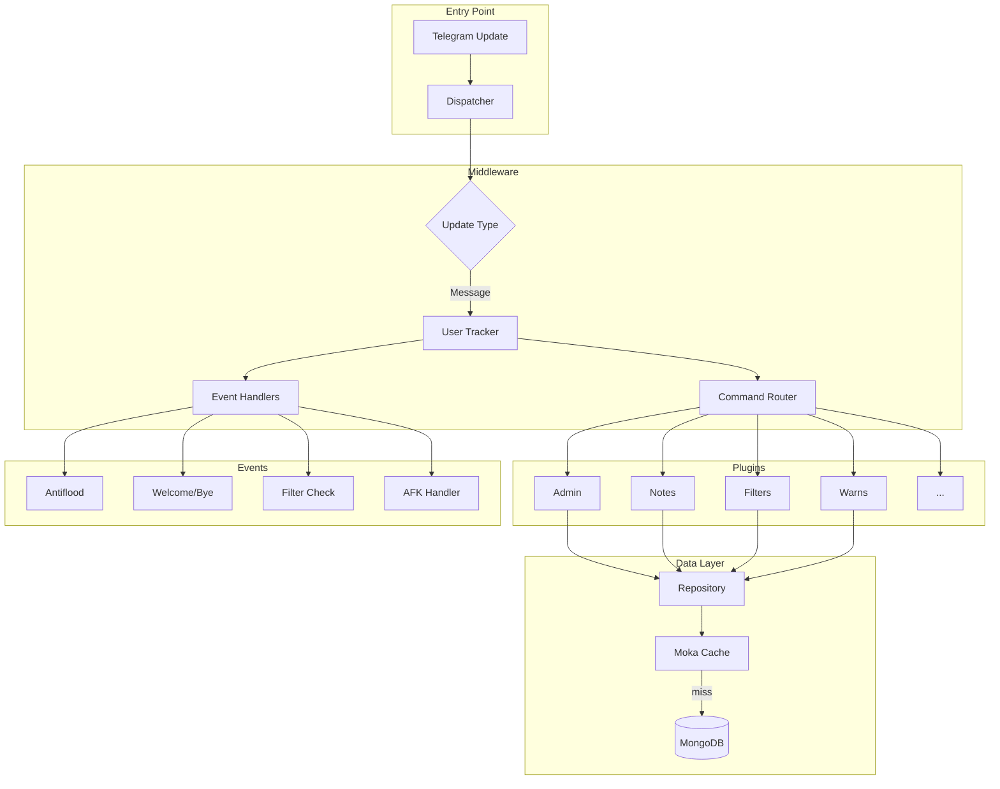
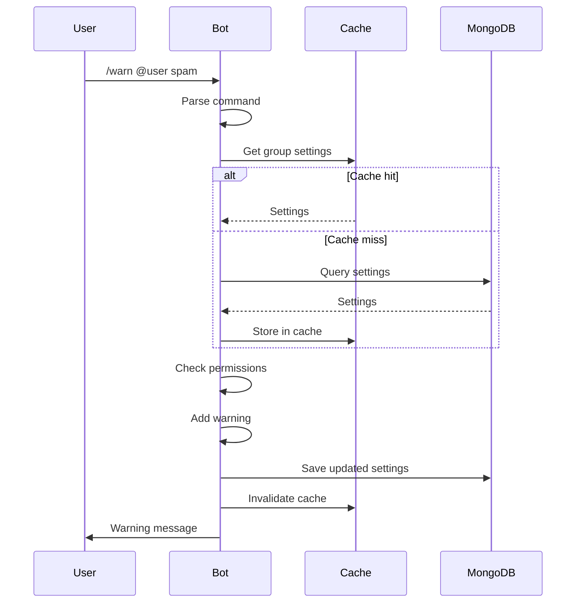

# Elysium 🌟

A modular Telegram bot framework for group management, built with Rust and Teloxide.

## Features

- 🛡️ **Admin Commands** - Ban, mute, kick, promote/demote
- ⚠️ **Warning System** - Configurable limits, modes, and expiry
- 🌊 **Antiflood Protection** - Automatic spam detection
- 👋 **Welcome/Goodbye** - Custom messages with placeholders
- 📝 **Notes** - Save and retrieve messages with `#shortcut`
- ⚙️ **Filters** - Auto-reply with keyword triggers
- 📜 **Rules** - Group rules with PM delivery option
- 💤 **AFK** - Away status notifications
- 🗑️ **Purge** - Bulk message deletion
- ✅ **Approval** - Bypass antiflood for trusted users

## Architecture



## Message Flow



## Configuration

Create `.env` file:

```env
TELOXIDE_TOKEN=your_bot_token
MONGODB_URI=mongodb://localhost:27017
MONGODB_DATABASE=elysium
OWNER_IDS=123456789,987654321
```

## Button Syntax

Notes, filters, welcome, and bye support inline buttons:

```
{button:Text|URL}                    # Single button
{button:A|URL}:{button:B|URL}        # Same row (colon)
{button:A|URL}                       # Different rows
{button:B|URL}                       # (newline)
```

## Placeholders

Available in welcome, goodbye, notes:

| Placeholder | Description |
|-------------|-------------|
| `{first}` | First name |
| `{last}` | Last name |
| `{fullname}` | Full name |
| `{mention}` | Clickable mention |
| `{id}` | User ID |
| `{group}` | Group name |
| `{count}` | Member count |

## Filter Types

```
/filter word reply           # Keyword (anywhere)
/filter =word reply          # Exact match
/filter *word reply          # Prefix match
/filter (a, b, c) reply      # Multi-trigger
```

## Warning Modes

| Mode | Description |
|------|-------------|
| `ban` | Permanent ban |
| `mute` | Permanent mute |
| `kick` | Kick from group |
| `tban 1d` | Temporary ban |
| `tmute 2h` | Temporary mute |

## Running

```bash
# Development
cargo run

# Production
cargo build --release
./target/release/elysium
```

## Tech Stack

- **Language**: Rust 2024 Edition
- **Framework**: Teloxide 0.13
- **Database**: MongoDB 3.1
- **Cache**: Moka (sync) + DashMap
- **Runtime**: Tokio

## License

MIT
