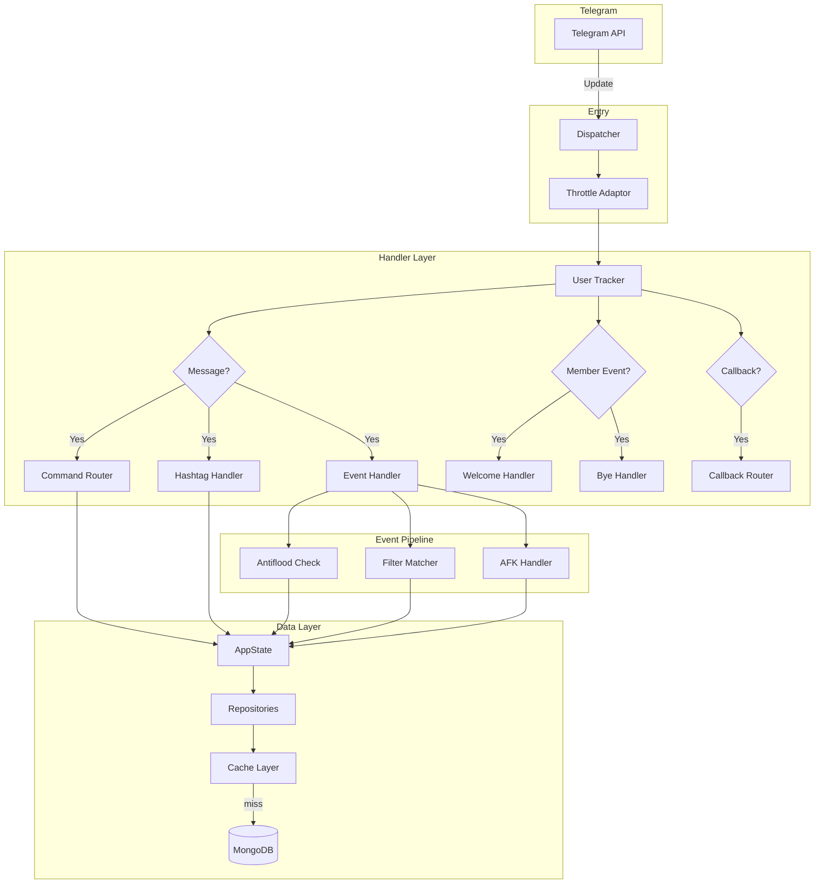
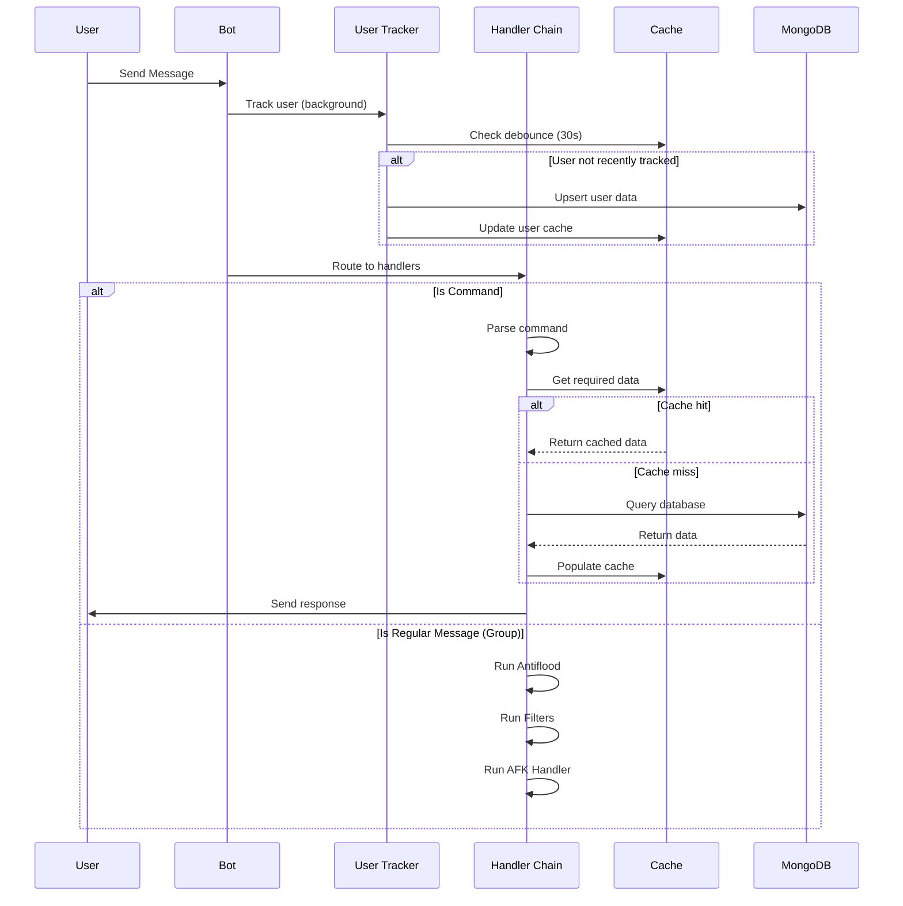
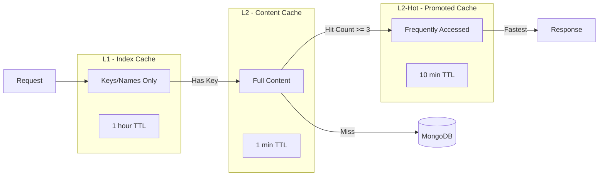

# Elysium

A high-performance, modular Telegram bot framework for group management, built with Rust and Teloxide.

## How It Works

Elysium receives Telegram updates (messages, member events, callbacks) through Teloxide's dispatcher system. Each update flows through a layered handler architecture, where different handlers process specific types of interactions. The bot maintains an in-memory cache layer backed by MongoDB for persistence, ensuring fast response times while maintaining data durability.

## Architecture Overview



## Request Flow

When a message arrives:



## Caching Strategy

Elysium uses a multi-tiered caching system to minimize database queries while keeping memory usage efficient:

### Cache Tiers



| Tier | What's Cached | TTL | Purpose |
|------|--------------|-----|---------|
| L1 | Keys/indices only (e.g., list of filter triggers per chat) | 1 hour | Fast existence checks without loading full content |
| L2 | Full content (e.g., complete filter/note data) | 1 min | Short-lived cache for content that may change |
| L2-Hot | Promoted frequently-accessed items | 10 min | Extended caching for popular content |

### Hot Promotion

Items accessed 3+ times within their L2 TTL are automatically promoted to L2-Hot, extending their cache lifetime. This happens transparently:

```
Request → Check L2-Hot (fastest) → Check L2 → Increment hit counter → Promote if threshold reached
```

### Cache Types by Domain

| Domain | Cache Strategy | Details |
|--------|---------------|---------|
| Filters | L1 + L2 + L2-Hot | L1 holds trigger names per chat, L2/Hot holds filter content |
| Notes | L1 + L2 + L2-Hot | L1 holds note names per chat, L2/Hot holds note content |
| Users | Dual-index + Debounce | Cached by ID and username, 30s debounce prevents redundant DB writes |
| Admin Permissions | Single-tier | 5 min TTL with 2 min idle timeout |
| Message Context | Single-tier | 10 min TTL for antiflood config + approved users |

## Component Responsibilities

### AppState

Central state container holding all shared resources:
- Database connection
- Cache registry
- All repositories (users, filters, notes, warns, etc.)
- Permission checker
- Bot owner IDs

### Repositories

Each data domain has its own repository that encapsulates:
- MongoDB collection access
- Cache management
- Business logic for that domain

```
UserRepo          - User tracking, AFK status, language preference
FilterRepository  - Auto-reply triggers with L1/L2/Hot caching
NoteRepository    - Saved messages with L1/L2/Hot caching
WarnsRepository   - User warnings and limits
MessageContextRepository - Antiflood config + approved users
WelcomeRepository - Welcome message settings
ByeRepository     - Goodbye message settings
RulesRepository   - Group rules
```

### Event Handlers

Non-command events processed for every group message:

| Handler | Function |
|---------|----------|
| Antiflood | Tracks message frequency, applies penalties (mute/kick/ban) when threshold exceeded |
| Filters | Matches message text against triggers, sends configured responses |
| AFK | Detects user return, notifies when AFK users are mentioned |

### FloodTracker

In-memory flood detection using DashMap (lock-free concurrent hashmap):
- Tracks message timestamps per user per chat
- Resets counters when a different user speaks (conversation interrupt)
- Configurable thresholds and warning counts before penalty

## Internationalization

Translations are embedded at compile time from JSON files:

```
locales/
├── en.json (English)
└── id.json (Indonesian)
```

Locale resolution priority:
1. Group-level language setting
2. User-level language preference  
3. Default: English

## Rate Limiting

The bot uses Teloxide's Throttle adaptor which automatically respects Telegram's rate limits:
- 30 messages/second globally
- 1 message/second to the same chat
- 20 messages/minute to the same group

## Permissions

Admin permissions are cached for 5 minutes (with 2 min idle expiry). Bot owners (from `OWNER_IDS`) bypass all permission checks automatically.

## Configuration

```env
TELOXIDE_TOKEN=your_bot_token
MONGODB_URI=mongodb://localhost:27017
MONGODB_DATABASE=elysium
OWNER_IDS=123456789,987654321
```

## Running

```bash
# Development
cargo run

# Production
cargo build --release
./target/release/elysium
```

## Tech Stack

- **Language**: Rust 2024 Edition
- **Framework**: Teloxide 0.13
- **Database**: MongoDB 3.1
- **Cache**: Moka (LRU with TTL/TTI support)
- **Concurrent Maps**: DashMap
- **Memory Allocator**: jemalloc (non-Windows)
- **Runtime**: Tokio

## License

MIT
